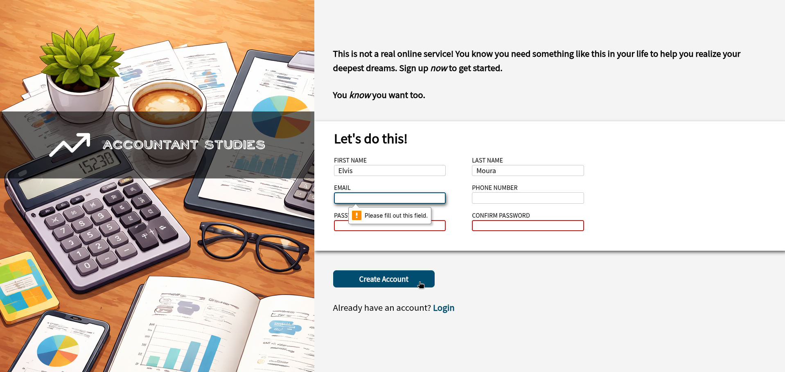

# Sign-up Form

> Um formulário de login feito com HTML e CSS.

## 🚀 Live Preview

**[Clique aqui para testar o projeto](https://elvismourab.github.io/sign-up-form/)**

## 📖 Descrição

Este projeto faz parte do currículo do [The Odin Project](https://www.theodinproject.com). O objetivo é aplicar os conhecimentos aprendidos no <i>Intermediate HTML and CSS Course</i>.

[Project: Sign-up Form](https://www.theodinproject.com/lessons/node-path-intermediate-html-and-css-sign-up-form)

## 🛠️ Tech Stack
- HTML5
- CSS3

## 🧠 O que aprendi

- Utilizar pseudo-classes para estilizar form controls.
- Uso do flex para organizar elementos na tela.
- Uso de fontes customizadas.
- Uso de diferentes tipos de unidades css.

## 💻 Como Executar Localmente

1. Clone o repositório.
2. Entre no diretório.
3. Abra o `index.html` no navegador.
